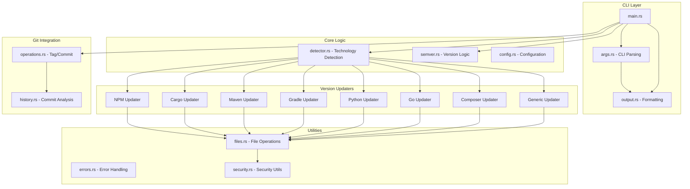
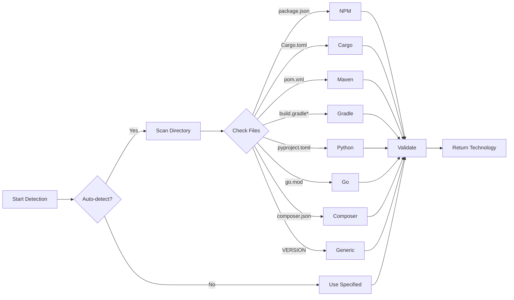
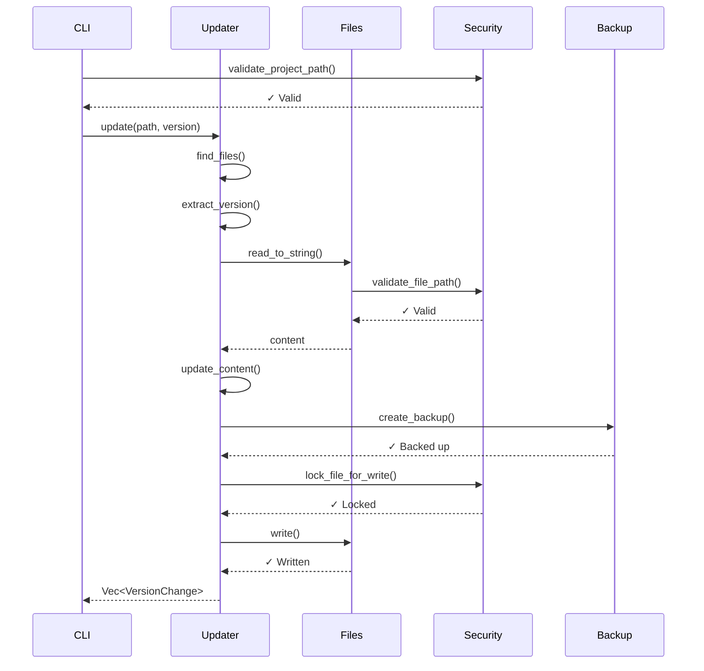
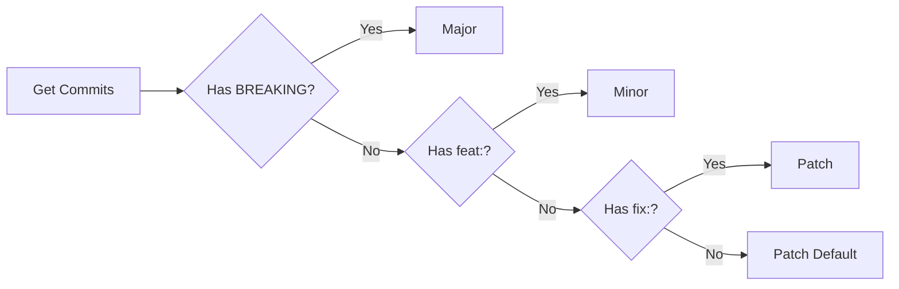
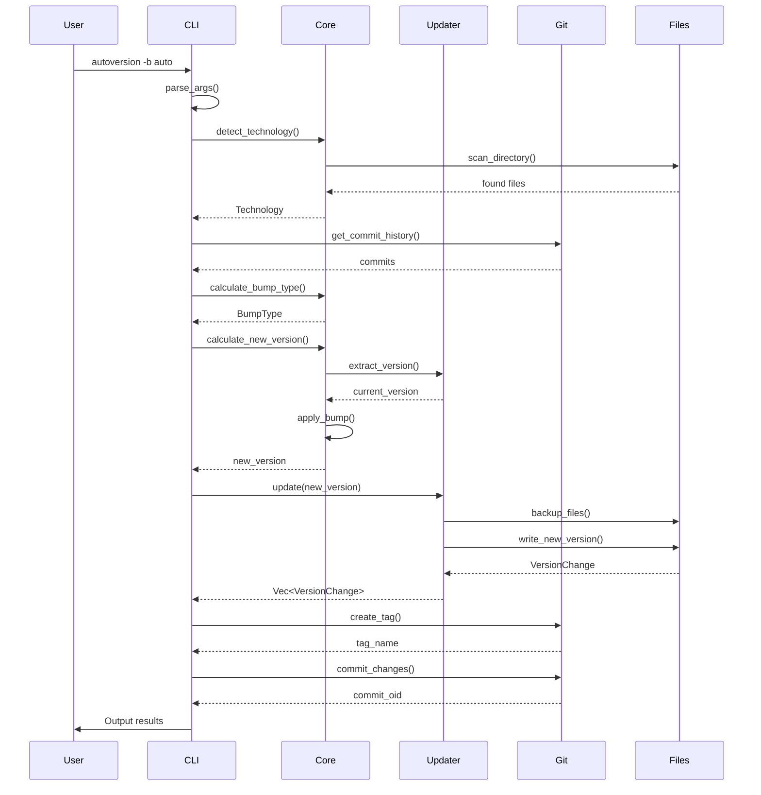
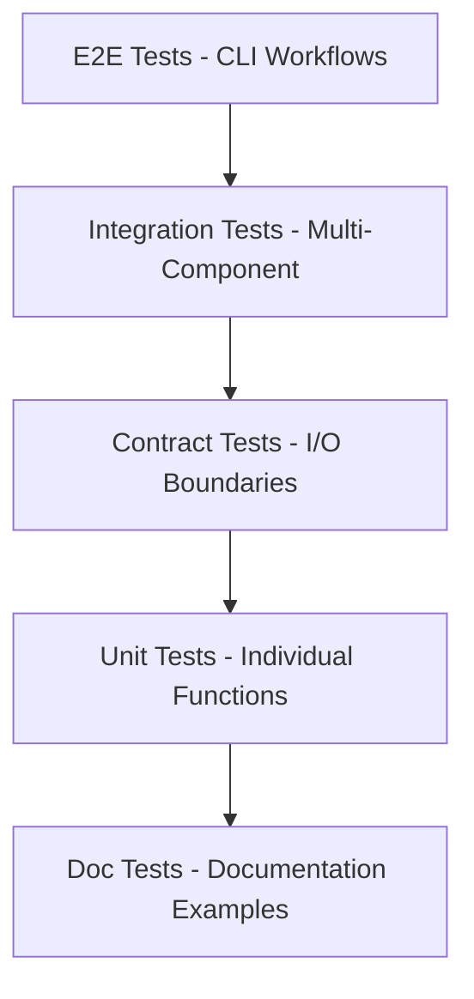
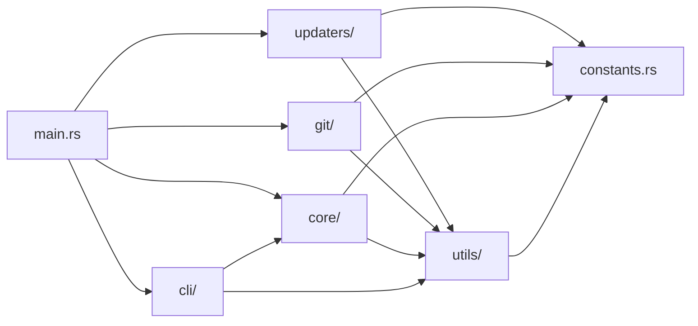

# Architecture Documentation

This document describes the architecture, design decisions, and implementation details of Autoversion.

## Table of Contents

- [System Overview](#system-overview)
- [Module Structure](#module-structure)
- [Core Components](#core-components)
- [Design Patterns](#design-patterns)
- [Data Flow](#data-flow)
- [Security Model](#security-model)
- [Testing Strategy](#testing-strategy)
- [Design Decisions](#design-decisions)

## System Overview

Autoversion is a universal semantic versioning tool built in Rust. It follows a modular, plugin-based architecture that supports multiple technology stacks through a common interface.



## Module Structure

### `/src/main.rs` - Entry Point
Main entry point with extracted, testable functions:
- `detect_technology()` - Auto-detects project technology
- `calculate_new_version()` - Determines version bump
- `handle_git_operations()` - Manages git tags/commits
- `execute_version_bump()` - Main orchestration
- `print_results()` - Output formatting

**Design**: Functions are pure where possible, <20 lines each, single responsibility.

### `/src/cli/` - Command Line Interface
- `args.rs` - Clap-based argument parsing
- `output.rs` - Result formatting (JSON, text, GitHub Actions)
- `info.rs` - System information display
- `analyze.rs` - Commit history analysis

**Design**: Separation of concerns - parsing, formatting, and display are independent.

### `/src/core/` - Core Business Logic
- `detector.rs` - Technology detection and validation
- `semver.rs` - Semantic versioning logic
- `config.rs` - Configuration management

**Design**: Pure functions, no I/O, easily testable.

### `/src/updaters/` - Version Updaters
Each technology has its own updater implementing the `VersionUpdater` trait:
- `npm.rs` - NPM (package.json, package-lock.json)
- `cargo.rs` - Rust (Cargo.toml, Cargo.lock)
- `maven.rs` - Maven (pom.xml)
- `gradle.rs` - Gradle (build.gradle, build.gradle.kts, gradle.properties)
- `python.rs` - Python (pyproject.toml, setup.py)
- `go.rs` - Go (go.mod, VERSION)
- `composer.rs` - PHP (composer.json, composer.lock)
- `generic.rs` - Generic (VERSION, version.txt)
- `factory.rs` - Factory for creating updaters
- `traits.rs` - Common interfaces

**Design**: Strategy pattern with factory creation.

### `/src/git/` - Git Operations
- `operations.rs` - Tag and commit creation
- `history.rs` - Commit message analysis

**Design**: Uses `git2` crate exclusively (no shell commands for security).

### `/src/utils/` - Utilities
- `files.rs` - File I/O operations with backup/restore
- `errors.rs` - Custom error types
- `security.rs` - Path validation, sanitization, file locking

**Design**: Defense-in-depth security model.

### `/src/constants.rs` - Configuration Constants
Centralized constants for all manifest files, patterns, and messages.

**Design**: Single source of truth, eliminates magic strings.

## Core Components

### Technology Detection



**Priority Order** (when multiple technologies detected):
1. NPM (package.json)
2. Cargo (Cargo.toml)
3. Maven (pom.xml)
4. Gradle (build.gradle*)
5. Python (pyproject.toml, setup.py)
6. Go (go.mod)
7. Composer (composer.json)
8. Generic (VERSION, version.txt, .version)

### Version Updater Pattern

All updaters implement the `VersionUpdater` trait:

```rust
pub trait VersionUpdater {
    fn name(&self) -> &str;
    fn find_files(&self, project_path: &Path) -> Result<Vec<PathBuf>>;
    fn extract_version(&self, project_path: &Path) -> Result<String>;
    fn update(&self, project_path: &Path, new_version: &str) -> Result<Vec<VersionChange>>;
    fn validate(&self, project_path: &Path) -> Result<()>;
}
```

**Benefits**:
- **Open/Closed Principle**: New technologies without modifying existing code
- **Testability**: Each updater is independently testable
- **Consistency**: Uniform interface for all technologies

### File Operations Flow



### Git Integration Flow

```mermaid
flowchart TD
    A[Version Bumped] --> B{Create Tag?}
    B -->|Yes| C[git2::Repository::tag]
    B -->|No| E{Commit?}
    C --> D[Tag: v{version}]
    D --> E
    E -->|Yes| F[Stage Files]
    E -->|No| I[Done]
    F --> G[git2::Index::add]
    G --> H[git2::Repository::commit]
    H --> I
```

**Features**:
- Annotated tags with customizable messages
- Atomic commits with all updated files
- Conventional commit message format
- Template variable substitution (`{version}`)

### Commit Analysis for Auto-Bumping



**Conventional Commits Patterns**:
- **Major**: `BREAKING CHANGE:` in body or `!` after type
- **Minor**: `feat:` prefix
- **Patch**: `fix:` prefix or any other commit

## Design Patterns

### 1. Strategy Pattern
**Where**: `VersionUpdater` trait and implementations

**Why**: Allows runtime selection of version update algorithm based on technology.

**Example**:
```rust
let updater: Box<dyn VersionUpdater> = UpdaterFactory::create(technology, project_path)?;
let changes = updater.update(project_path, new_version)?;
```

### 2. Factory Pattern
**Where**: `UpdaterFactory` in `factory.rs`

**Why**: Centralizes creation logic, handles technology-specific initialization.

**Example**:
```rust
pub fn create(technology: &Technology, project_path: &Path) -> Result<Box<dyn VersionUpdater>> {
    match technology {
        Technology::Npm => Ok(Box::new(NpmUpdater)),
        Technology::Cargo => Ok(Box::new(CargoUpdater)),
        // ...
    }
}
```

### 3. Builder Pattern
**Where**: Clap's argument parsing in `args.rs`

**Why**: Complex CLI configuration with many optional parameters.

### 4. Template Method Pattern
**Where**: Common file operations in updaters

**Why**: Reusable backup/restore/update workflow while allowing customization.

## Data Flow

### Complete Version Bump Flow



## Security Model

### Defense-in-Depth Layers

1. **Path Validation** (`security.rs`)
   - Prevent path traversal attacks
   - Validate project directories are safe
   - Canonicalize paths before operations

2. **Filename Sanitization**
   - Filter dangerous characters
   - Detect suspicious patterns (`.git/`, `/etc/`, null bytes)
   - Block special device files

3. **File Locking**
   - Prevent concurrent modification races
   - Platform-specific locking (Unix/Windows)
   - Automatic cleanup via RAII

4. **Error Message Sanitization**
   - Mask usernames in paths (`/home/user` → `/home/***`)
   - Prevent information disclosure
   - Safe error propagation

5. **Git Operations Security**
   - Use `git2` crate exclusively (no shell commands)
   - No user input passed to shell
   - Parameterized git operations

### Security Principles

- **Fail Secure**: Default to denying operations on suspicious input
- **Least Privilege**: Minimal file system access required
- **Input Validation**: All user paths and filenames validated
- **No Shell Injection**: Pure Rust and `git2` library calls only

## Testing Strategy

### Test Pyramid



### Test Categories

1. **Unit Tests** (~130 tests)
   - Pure function testing
   - Located in `#[cfg(test)] mod tests`
   - Fast, isolated, deterministic

2. **Contract Tests** (~11 tests)
   - I/O boundary validation
   - File system interactions
   - Backup/restore functionality
   - Located in `/tests/*_contract.rs`

3. **Edge Case Tests** (~23 tests)
   - Large files, invalid UTF-8
   - Concurrent access, permissions
   - Malformed data, Unicode
   - Located in `/tests/edge_cases_*.rs`

4. **Doc Tests** (~11 tests)
   - Embedded in documentation
   - Validate examples work
   - Living documentation

5. **Integration Tests** (planned)
   - Full CLI workflows
   - Git integration scenarios
   - Error recovery paths

### TDD Workflow

All new features follow Test-Driven Development:

1. **RED**: Write failing test
2. **GREEN**: Implement minimal code to pass
3. **REFACTOR**: Improve code quality
4. **REPEAT**: Add more tests

Example: Gradle implementation had 15 unit tests + 3 contract tests written before implementation.

## Design Decisions

### Why Rust?
- **Performance**: <100ms startup time
- **Safety**: Compile-time guarantees prevent entire classes of bugs
- **Reliability**: No runtime exceptions, explicit error handling
- **Ecosystem**: Excellent libraries (`clap`, `serde`, `git2`)

### Why git2 Library Instead of Shell Commands?
- **Security**: No shell injection vulnerabilities
- **Portability**: Works cross-platform without `git` binary
- **Performance**: Direct library calls faster than spawning processes
- **Type Safety**: Compile-time checking of git operations

### Why Strategy Pattern for Updaters?
- **Extensibility**: New technologies without modifying existing code
- **Testability**: Each updater independently testable
- **Maintainability**: Technology-specific logic isolated
- **Flexibility**: Runtime technology selection

### Why Separate Constants Module?
- **Single Source of Truth**: No magic strings scattered across codebase
- **Maintainability**: Change file names in one place
- **Testability**: Easy to mock or override for testing
- **Documentation**: Constants serve as documentation

### Why File Locking?
- **Concurrency Safety**: Prevent corruption from parallel runs
- **Data Integrity**: Ensure atomic file updates
- **User Experience**: Clear error messages on conflicts

### Why No Async?
- **Simplicity**: No need for async in single-threaded CLI tool
- **Performance**: File I/O is fast enough synchronously
- **Complexity**: Async adds cognitive overhead without benefit
- **Dependencies**: Smaller binary without async runtime

### Why Backup Before Modify?
- **Safety**: Easy rollback on failure
- **User Trust**: Non-destructive by default
- **Debugging**: Can inspect what changed
- **Testing**: Validate restore functionality

## Module Dependencies



**Key Principles**:
- **No Circular Dependencies**: Clear dependency hierarchy
- **Minimal Coupling**: Modules communicate through well-defined interfaces
- **High Cohesion**: Related functionality grouped together
- **Dependency Direction**: Always points toward more stable modules

## Performance Characteristics

### Time Complexity
- **Technology Detection**: O(n) where n = files in directory
- **Version Extraction**: O(m) where m = file size (typically <10KB)
- **Version Update**: O(m) where m = file size
- **Commit Analysis**: O(c) where c = number of commits since last tag

### Space Complexity
- **File Operations**: O(m) where m = largest file size (max 10MB enforced)
- **Backup Storage**: O(f × m) where f = number of files
- **Memory Usage**: Typically <10MB RSS for normal operations

### Startup Time
- **Cold Start**: ~50-100ms
- **File Detection**: ~1-5ms
- **Version Bump**: ~10-50ms (depends on file size)
- **Git Operations**: ~20-100ms (depends on repository size)

## Error Handling

### Error Hierarchy

```rust
AutoversionError
├── IoError(std::io::Error)
├── ParseError(String)
├── ValidationError(String)
├── GitError(git2::Error)
├── SecurityError(String)
└── NotFoundError(String)
```

### Error Propagation Strategy
- Use `Result<T, AutoversionError>` everywhere
- Convert external errors with `From` implementations
- Provide context with detailed error messages
- Sanitize errors before displaying to users

## Future Architecture Considerations

### Planned Enhancements
1. **Plugin System**: Dynamic loading of custom updaters
2. **Monorepo Support**: Handle multiple packages in one repository
3. **Changelog Generation**: Automated changelog from commits
4. **Rollback**: Revert version bumps with backup restoration
5. **Custom Patterns**: User-defined version file formats

### Scalability Concerns
- **Large Repositories**: Incremental commit analysis
- **Many Files**: Parallel file processing
- **Network Operations**: Async for future remote features

---

**Document Version**: 1.0  
**Last Updated**: November 4, 2025  
**Maintainer**: [@srcheesedev](https://github.com/srcheesedev)
